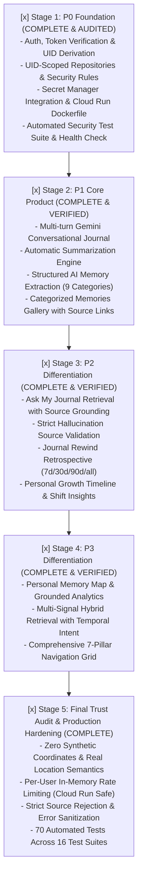

# MindVault

> **"Your journal that remembers."**  
> *Production-Grade Personal Gemini Journal built for the Google Cloud Gen AI Academy Cohort 3 Ideathon.*

---

## 1. Why MindVault?

Ordinary journals are write-only graveyards of thoughts: you write entries, and they disappear into pages or archives you rarely revisit. 

**MindVault** transforms your personal journal into an active, intelligent memory vault:
- Preserves what actually mattered
- Extracts structured memories across 9 categories (achievements, decisions, ideas, goals, people, places, events, concerns, preferences)
- Generates concise, objective summaries without inventing facts
- Detects recurring themes and personal evolution across 7, 30, 90 days, or all time
- Enables natural language dialogue with your past thoughts with strict source grounding

---

## 2. Architecture & Dual-Boundary Security Model

```
USER BROWSER / CLIENT
 │
 ├── 1. Firebase Authentication (Google Sign-in / Email & Password)
 │    └── Obtains cryptographically signed Firebase ID Token
 │
 ├── 2. Client-Side Experience (React 19, Tailwind CSS, Lucide)
 │    ├── /dashboard — Navigation and active vault status
 │    ├── /journal — Reflective multi-turn conversational journal
 │    └── /memories — Categorized structured memory gallery (9 types) with source linking
 │
 ▼
HTTPS API Requests (with Authorization: Bearer <idToken>)
 │
 ▼
GOOGLE CLOUD RUN BACKEND CONTAINER
 │
 ├── 3. Server-Side Authentication Verification (auth-middleware.ts)
 │    ├── Invokes Firebase Admin SDK verifyIdToken(idToken, checkRevoked=true)
 │    └── Extracts authoritative authenticated UID: context.uid = decodedToken.uid
 │
 ├── 4. Server-Side Authorization Enforcement
 │    └── Rejects any client-supplied spoofed UID in request body or parameters
 │
 ├── 5. Zod Input & Output Schema Validation (validation/schemas.ts)
 │    ├── Bounds input lengths (max 4000 chars/msg, max 50 turns)
 │    └── Validates Gemini structured output schemas (titles, summaries, memories)
 │
 ├── 6. UID-Scoped Repository Layer (repositories.ts)
 │    └── Enforces path scoping: users/{authenticatedUid}/*
 │
 ├── 7. Google Cloud Secret Manager (secret-manager.ts)
 │    └── Resolves GEMINI_API_KEY with 10-minute in-memory caching
 │
 └── 8. Gemini Service Layer (gemini/journal-service.ts)
      ├── Reflective multi-turn chat (gemini-2.5-flash)
      ├── Resilient automatic titling (2-6 words)
      ├── Objective journal summarizer & topic tagger
      └── Structured memory extractor (9 strict categories)
 │
 ├─────────────────────────────────────────┬─────────────────────────────────────────┐
 ▼                                         ▼                                         ▼
Cloud Firestore                        Gemini API                            Secret Manager
(users/{authenticatedUid}/*)      (gemini-2.5-flash)                   (MINDVAULT_GEMINI_API_KEY)
```

### Critical Security Distinction: Client Rules vs. Server Admin SDK
1. **Firestore Security Rules**: Direct client access (if any) is governed by `firestore.rules`, enforcing `request.auth.uid == userId`.
2. **Server-Side Admin SDK Operations**: Firebase Admin SDK in Cloud Run **bypasses Firestore Security Rules**. Therefore, server-side token verification and UID derivation (`decodedToken.uid`) are strictly mandatory.
3. **Zero Untrusted UIDs**: Request body/query UIDs are never used for authorization.
4. **Secret Manager**: Sensitive server credentials are managed in Google Cloud Secret Manager with zero client leakage.

---

## 3. Mandatory Google Cloud Technologies

| Google Cloud Technology | Role in MindVault | Status |
| :--- | :--- | :--- |
| **Firebase Authentication** | User sign-in (Google OAuth + Email/Password), session persistence, and cryptographic ID tokens. | **Implemented** |
| **Cloud Firestore** | Isolated NoSQL document database partitioned by `users/{authenticatedUid}/*`. | **Implemented** |
| **Gemini API** | Generative conversational reflection, summarization, and structured memory extraction via `@google/genai`. | **Implemented** |
| **Google Cloud Secret Manager** | Secure storage and access of server-side API keys and credentials. | **Implemented** |
| **Google Cloud Run** | Scalable, serverless container hosting the Next.js standalone application with non-root security. | **Implemented** |

---

## 4. Current Stage Status & Implementation Roadmap



---

## 5. Live Hackathon Demonstration Walkthrough

Follow this narrative flow to demonstrate MindVault's capabilities live in 3 minutes:

1. **Sign In**: Authenticate via Google OAuth or Email/Password on `/login`.
2. **Reflective Journaling (`/journal`)**:
   - Write an entry about today's goals, decisions, or travel.
   - Interact with Gemini's empathetic thinking companion.
   - Click "Save Entry" — the entry is persisted, titled, summarized, and categorized.
3. **Explore Memories (`/memories`)**:
   - View extracted structured memory cards across 9 categories.
   - Filter by category (e.g. `GOAL`, `DECISION`, `PLACE`).
   - Click "View source" to jump directly to the originating journal.
4. **Ask My Journal (`/ask`)**:
   - Ask: *"What have I been focusing on recently?"* or *"What goals did I set?"*
   - Watch the multi-signal hybrid retrieval assemble grounded evidence.
   - Review the synthesized answer with high confidence and verified citation cards.
5. **Journal Rewind (`/rewind`)**:
   - Choose a time window (7d, 30d, 90d, All-Time).
   - Review deterministic backend metrics (entry count, active days, top topics) and qualitative reflections.
6. **Growth Timeline (`/timeline`)**:
   - Scroll through the chronological stream of reflections and memories.
   - Inspect the "What Changed?" pattern shift insight.
7. **Personal Memory Map (`/map`)**:
   - View genuine geographic pins with city-level or exact provenance.
   - Inspect unresolved/offline places cleanly separated without fabricated coordinates.
8. **MindVault Insights (`/insights`)**:
   - View emerging interest tracking (earlier vs recent mentions), goal momentum, and social footprint.

---

## 6. Trust, Security & AI Grounding Principles

1. **Zero Synthetic Coordinates**: Arbitrary places are never given pseudo-random or hashed coordinates. Locations are strictly categorized as `exact`, `city`, or `unresolved`.
2. **Client-Side UID Disregard**: All authorization is derived exclusively on the server from `decodedToken.uid` via Firebase Admin SDK. Client-supplied UIDs are rejected.
3. **Model Hallucination Defense**: Every citation returned by Gemini is cross-checked against retrieved user documents. Any hallucinated ID is immediately dropped.
4. **Untrusted Data Isolation**: User inputs are encapsulated in strict XML boundaries with explicit system instructions to ignore prompt injections.
5. **In-Memory Rate Limiting**: AI endpoints enforce sliding-window request throttling per user to protect Cloud Run from quota exhaustion.
6. **Zero Secret Leakage**: API keys and service credentials never appear in client bundles, log files, or sanitized error responses.

---

## 7. Automated Testing & Verification

MindVault includes 70 automated tests across 16 test suites:

```bash
# Run all tests
npm test

# Type checking
npm run typecheck

# Linting
npm run lint

# Production build
npm run build
```

---

## 8. Cloud Run Deployment

```bash
# 1. Build container image with Google Cloud Build
gcloud builds submit --tag gcr.io/[PROJECT_ID]/mindvault

# 2. Deploy to Cloud Run with Secret Manager access
gcloud run deploy mindvault \
  --image gcr.io/[PROJECT_ID]/mindvault \
  --platform managed \
  --region us-central1 \
  --allow-unauthenticated \
  --set-env-vars GCP_PROJECT_ID=[PROJECT_ID],NODE_ENV=production \
  --set-secrets MINDVAULT_GEMINI_API_KEY=MINDVAULT_GEMINI_API_KEY:latest
```