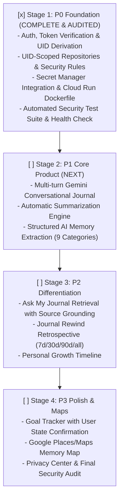

# MindVault

> **"Your journal that remembers."**  
> *Production-Grade Personal Gemini Journal built for the Google Cloud Gen AI Academy Cohort 3 Ideathon.*

---

## 1. Why MindVault?

Ordinary journals are write-only graveyards of thoughts: you write entries, and they disappear into pages or archives you rarely revisit. 

**MindVault** transforms your personal journal into an active, intelligent memory vault:
- Preserves what actually mattered
- Extracts structured memories (achievements, decisions, ideas, goals, people, places)
- Detects recurring themes and personal evolution across 7, 30, 90 days, or all time
- Enables natural language dialogue with your past thoughts with strict source grounding

---

## 2. Architecture & Dual-Boundary Security Model

```
USER BROWSER / CLIENT
 │
 ├── 1. Firebase Authentication (Google Sign-in / Email & Password)
 │    └── Obtains cryptographically signed Firebase ID Token
 │
 ├── 2. Client-Side Navigation & UI (React 19, Tailwind CSS, Lucide)
 │
 ▼
HTTPS API Request (with Authorization: Bearer <idToken>)
 │
 ▼
GOOGLE CLOUD RUN BACKEND CONTAINER
 │
 ├── 3. Server-Side Authentication Verification (auth-middleware.ts)
 │    ├── Invokes Firebase Admin SDK verifyIdToken(idToken, checkRevoked=true)
 │    └── Extracts authoritative authenticated UID: context.uid = decodedToken.uid
 │
 ├── 4. Server-Side Authorization Enforcement
 │    └── Rejects any client-supplied spoofed UID in request body or parameters
 │
 ├── 5. UID-Scoped Repository Layer (repositories.ts)
 │    └── Enforces path scoping: users/{authenticatedUid}/*
 │
 ├── 6. Google Cloud Secret Manager (secret-manager.ts)
 │    └── Fetches GEMINI_API_KEY with 10-minute in-memory caching
 │
 └── 7. Gemini Service (gemini/client.ts)
      └── Interacts with Gemini 2.5 Flash via @google/genai SDK
 │
 ├─────────────────────────────────────────┬─────────────────────────────────────────┐
 ▼                                         ▼                                         ▼
Cloud Firestore                        Gemini API                            Secret Manager
(users/{authenticatedUid}/*)      (gemini-2.5-flash)                   (MINDVAULT_GEMINI_API_KEY)
```

### Critical Security Distinction: Client Rules vs. Server Admin SDK
1. **Firestore Security Rules**: Direct client access (if any) is governed by `firestore.rules`, enforcing `request.auth.uid == userId`.
2. **Server-Side Admin SDK Operations**: Firebase Admin SDK in Cloud Run **bypasses Firestore Security Rules**. Therefore, server-side token verification and UID derivation (`decodedToken.uid`) are strictly mandatory.
3. **Zero Untrusted UIDs**: Request body/query UIDs are never used for authorization.
4. **Secret Manager**: Sensitive server credentials are managed in Google Cloud Secret Manager with zero client leakage.

---

## 3. Mandatory Google Cloud Technologies

| Google Cloud Technology | Role in MindVault | Status |
| :--- | :--- | :--- |
| **Firebase Authentication** | User sign-in (Google OAuth + Email/Password), session persistence, and cryptographic ID tokens. | **Implemented (Stage 1)** |
| **Cloud Firestore** | Isolated NoSQL document database partitioned by `users/{authenticatedUid}/*`. | **Implemented (Stage 1)** |
| **Gemini API** | Generative conversational reflection, summarization, memory extraction, and retrospectives via `@google/genai`. | **Foundation Implemented (Stage 1) / Endpoints in Stage 2** |
| **Google Cloud Secret Manager** | Secure storage and access of server-side API keys and credentials. | **Implemented (Stage 1)** |
| **Google Cloud Run** | Scalable, serverless container hosting the Next.js standalone application with non-root security. | **Implemented (Stage 1)** |

---

## 4. Current Stage Status & Implementation Roadmap



---

## 5. Local Setup & Environment

### Prerequisites
- Node.js 20+ (Node 22 / 24 recommended)
- npm 10+
- Google Cloud SDK (`gcloud`)

### Step 1: Clone and Install Dependencies
```bash
git clone https://github.com/pavankarthikeyaatchyuta-lab/MINDVAULT.git
cd MINDVAULT
npm install
```

### Step 2: Configure Environment Variables
Copy `.env.example` to `.env.local` and add your Firebase and Gemini credentials:
```bash
cp .env.example .env.local
```

### Step 3: Run Development Server
```bash
npm run dev
```
Open [http://localhost:3000](http://localhost:3000) to view the application.

---

## 6. Automated Testing & Verification

MindVault includes an automated security test suite:

```bash
# Run all tests
npm test

# Run security test suite specifically
npm run test:security

# Type checking
npm run typecheck

# Linting
npm run lint

# Production build
npm run build
```

---

## 7. Cloud Run Deployment

```bash
# 1. Build container image with Google Cloud Build
gcloud builds submit --tag gcr.io/[PROJECT_ID]/mindvault

# 2. Deploy to Cloud Run with Secret Manager access
gcloud run deploy mindvault \
  --image gcr.io/[PROJECT_ID]/mindvault \
  --platform managed \
  --region us-central1 \
  --allow-unauthenticated \
  --set-env-vars GCP_PROJECT_ID=[PROJECT_ID],NODE_ENV=production \
  --set-secrets MINDVAULT_GEMINI_API_KEY=MINDVAULT_GEMINI_API_KEY:latest
```