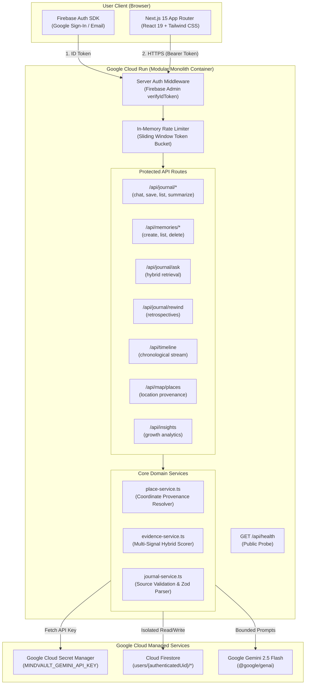

# MindVault

> **"Your journal that remembers."**  
> *Built for the Google Cloud Gen AI Academy Cohort 3 APAC Ideathon.*

---

## 1. The Problem

Most people who attempt to keep a personal journal eventually abandon it. Traditional journals are write-only graveyards of thoughts: entries are captured, the page or app is closed, and personal reflections disappear into chronological archives that are rarely rediscovered.

Standard journaling fails to:
- Actively surface past decisions when making new ones.
- Retain structured, actionable memories (goals, achievements, ideas, places, people).
- Allow users to query their past thoughts conversationally with trustworthy evidence.
- Track personal evolution across themes and focus areas over time.

---

## 2. The Solution

**MindVault** transforms private journaling from passive text storage into an active, intelligent memory companion.

Rather than acting as a generic chatbot inside a text editor, MindVault is built on a continuous personal reflection loop:

$$\text{Write} \longrightarrow \text{Remember} \longrightarrow \text{Ask} \longrightarrow \text{Reflect} \longrightarrow \text{Understand} \longrightarrow \text{Locate} \longrightarrow \text{Evolve}$$

1. **Write**: Express unfiltered thoughts with a supportive, non-judgmental Gemini thinking companion.
2. **Remember**: Automatically extract structured, actionable memories across 9 explicit categories.
3. **Ask**: Natural-language dialogue with your personal history using bounded, multi-signal evidence retrieval.
4. **Reflect**: Retrospective retrospectives across 7, 30, 90 days, or all time with deterministic metrics.
5. **Understand**: Visual chronological timeline with automatic pattern shift detection ("What Changed?").
6. **Locate**: Interactive memory map with verified location provenance and zero synthetic coordinates.
7. **Evolve**: Longitudinal personal pattern analysis tracking emerging interests and goal momentum.

---

## 3. Key Features

- **Writing-First Journal Editor**: Clean, distraction-free writing environment with synchronous Firestore persistence before AI enrichment to ensure zero journal loss.
- **Empathetic AI Thinking Companion**: Multi-turn dialogue powered by Gemini 2.5 Flash, strictly constrained from medical/psychological diagnosis.
- **Automatic Titling & Summarization**: Evocative 2–6 word titles and objective summaries without fact fabrication.
- **Structured Memory Extraction (9 Categories)**: Automatically identifies `ACHIEVEMENT`, `DECISION`, `IDEA`, `GOAL`, `EVENT`, `PERSON`, `PLACE`, `CONCERN`, and `PREFERENCE`.
- **Categorized Memories Gallery (`/memories`)**: Filter, edit, and trace memories back to their exact source journal entries.
- **Ask My Journal (`/ask`)**: Grounded natural-language query engine with verified source citations and strict zero-evidence fallback.
- **Journal Rewind (`/rewind`)**: Retrospective analysis combining deterministic database arithmetic with qualitative narrative synthesis.
- **Personal Growth Timeline (`/timeline`)**: Unified chronological stream uniting entries and structured memories with "What Changed?" insight.
- **Personal Memory Map (`/map`)**: Grounded geographic memory visualization distinguishing exact coordinates, recognized city centroids, and unresolved places.
- **MindVault Insights (`/insights`)**: Pattern discovery engine tracking emerging interest frequency shifts, goal momentum, and social footprint.

---

## 4. How Gemini is Used

MindVault leverages the **Google Gemini API** (`@google/genai` with model `gemini-2.5-flash`) across 5 specialized tasks:

| Feature | Role of Gemini | Grounding & Security Controls |
| :--- | :--- | :--- |
| **Journal Reflection** | Empathetic, Socratic thinking companion during active writing. | Strict system prompt boundaries; input treated as untrusted data; medical/psychological diagnosis prohibited. |
| **Summarization & Titling** | 2–6 word evocative titling and concise objective summary. | Schema validation (`zod`); deterministic word-count bounds; no fact fabrication. |
| **Structured Memory Extraction** | Identifies meaningful entities across 9 specific categories. | Strict Zod output schema validation; rejection of hallucinated categories. |
| **Ask My Journal** | Natural-language answers synthesized from retrieved evidence. | Multi-signal bounded evidence set; mandatory source validation; zero-evidence fallback bypasses Gemini entirely. |
| **Rewind & Insights** | Qualitative pattern and retrospective narrative synthesis. | Grounded in pre-calculated deterministic statistics (active days, topic frequencies); strict source ID validation. |

---

## 5. How Firebase Authentication is Used

- **Client Authentication**: Secure user sign-in via Google OAuth and Email/Password using the Firebase Client SDK.
- **Cryptographic ID Tokens**: The client obtains a cryptographically signed Firebase ID token.
- **Server-Side Token Verification**: Every protected API route invokes Firebase Admin SDK: `auth.verifyIdToken(idToken, checkRevoked=true)`.
- **Authoritative Identity Derivation**: User identity is derived exclusively from `decodedToken.uid`. Client-supplied UIDs in bodies, queries, or headers are strictly rejected.

---

## 6. How Firestore is Used

- **Dual-Boundary Security**:
  - **Client Boundary**: `firestore.rules` enforces `request.auth.uid == userId` for direct client access.
  - **Server Boundary**: Server-side Cloud Run operations isolate collections strictly by path: `users/{authenticatedUid}/*`.
- **Isolated Repositories**:
  - `users/{uid}/journals/{journalId}` — Journal entries and conversation histories.
  - `users/{uid}/memories/{memoryId}` — Structured memories linked via `sourceJournalId`.
  - `users/{uid}/goals/{goalId}` — User goal states.
  - `users/{uid}/rewinds/{rewindId}` — Retrospective summaries.
- **Cross-User Isolation**: Queries and writes are mathematically restricted to the authenticated UID subcollection.

---

## 7. How Google Cloud Secret Manager is Used

- **Zero Hardcoded Secrets**: Sensitive server credentials (e.g. `GEMINI_API_KEY`) are stored in Google Cloud Secret Manager under the secret name:
  ```text
  MINDVAULT_GEMINI_API_KEY
  ```
- **Server-Side Resolution**: `src/lib/secrets/secret-manager.ts` fetches the secret at runtime with a 10-minute in-memory cache to prevent quota bottlenecks.
- **Zero Client Exposure**: Secret Manager is imported exclusively in server-only modules; zero credentials or keys are exposed to the browser.

---

## 8. How Cloud Run is Used (Cloud Run-Ready)

MindVault is engineered as a containerized Next.js 15 standalone application optimized for Google Cloud Run:
- **Managed Serverless Execution**: Automatically handles TLS termination, horizontal autoscaling, and container lifecycle.
- **Least Privilege Security**: Container runs as an unprivileged non-root user (`nextjs:nodejs` UID 1001).
- **Dynamic Port Binding**: Listens dynamically on `$PORT` (default `8080`, `0.0.0.0`).
- **Health Check Probe**: Exposes public endpoint `GET /api/health` for Cloud Run liveness monitoring.

---

## 9. Security & Privacy Architecture

MindVault enforces a **10-Principle AI Security Constitution**:

1. **User journal content is untrusted data**: Encapsulated in XML data boundaries (`<user_journal_entry>`, `<verified_journal_evidence>`).
2. **User content never becomes system instructions**: System prompts are isolated and immune to prompt injection overrides.
3. **Gemini never determines authorization**: Access control is executed strictly by server-side Firebase Admin verification.
4. **Gemini never determines document ownership**: Ownership is derived strictly from verified UID paths.
5. **Gemini never becomes the system of record**: Cloud Firestore is the sole system of record.
6. **Deterministic metrics precede AI**: Arithmetic statistics (active days, counts, topic frequencies) are calculated by database logic, never guessed by AI.
7. **Zero Client UID Authority**: Client-supplied UIDs are rejected in favor of verified token claims.
8. **Independent Source Validation**: All AI-returned source IDs are cross-checked against retrieved evidence; hallucinated or cross-user references are rejected.
9. **In-Memory Rate Limiting**: Per-user sliding-window rate limiter protects expensive AI endpoints against abuse.
10. **Error Sanitization**: Error responses strip system paths (`/`, `\`) and credential filenames (`.json`) before returning to the client.

---

## 10. System Architecture Diagram



---

## 11. Local Development

### Prerequisites
- Node.js 20+ (Node 22 / 24 recommended)
- npm 10+
- Google Cloud SDK (`gcloud`)

### Step 1: Clone and Install Dependencies
```bash
git clone https://github.com/pavankarthikeyaatchyuta-lab/MINDVAULT.git
cd MINDVAULT
npm install
```

### Step 2: Configure Environment Variables
Copy `.env.example` to `.env.local` and add your Firebase and Gemini credentials:
```bash
cp .env.example .env.local
```

### Step 3: Run Development Server
```bash
npm run dev
```
Open [http://localhost:3000](http://localhost:3000) to view the application.

---

## 12. Environment Variables

| Variable Name | Scope | Description |
| :--- | :--- | :--- |
| `NEXT_PUBLIC_FIREBASE_API_KEY` | Client / Public | Firebase web API key |
| `NEXT_PUBLIC_FIREBASE_AUTH_DOMAIN` | Client / Public | Firebase Auth domain |
| `NEXT_PUBLIC_FIREBASE_PROJECT_ID` | Client / Public | Firebase / GCP project ID |
| `NEXT_PUBLIC_FIREBASE_STORAGE_BUCKET` | Client / Public | Firebase storage bucket |
| `NEXT_PUBLIC_FIREBASE_MESSAGING_SENDER_ID` | Client / Public | Firebase messaging sender ID |
| `NEXT_PUBLIC_FIREBASE_APP_ID` | Client / Public | Firebase web application ID |
| `FIREBASE_PROJECT_ID` | Server Only | GCP / Firebase project ID for Admin SDK |
| `FIREBASE_CLIENT_EMAIL` | Server Only | Firebase Admin service account email |
| `FIREBASE_PRIVATE_KEY` | Server Only | Firebase Admin service account private key |
| `GCP_PROJECT_ID` | Server Only | Google Cloud Project ID for Secret Manager |
| `GEMINI_API_KEY` | Server Only | Local fallback for Gemini API key (Secret Manager preferred in prod) |

---

## 13. Testing & Automated Verification

MindVault includes **70 automated unit and security tests** across 16 test suites:

```bash
# Run all 70 tests
npm test

# Run TypeScript typecheck
npm run typecheck

# Run ESLint check
npm run lint

# Run production standalone build
npm run build
```

---

## 14. Deployment (Cloud Run Ready)

MindVault is fully containerized and Cloud Run-ready. Deploy to Google Cloud Run with Secret Manager access:

```bash
# 1. Set active project
gcloud config set project [YOUR_GCP_PROJECT_ID]

# 2. Enable required Google Cloud services
gcloud services enable run.googleapis.com \
                       artifactregistry.googleapis.com \
                       secretmanager.googleapis.com \
                       cloudbuild.googleapis.com

# 3. Create Gemini API key in Secret Manager
echo -n "[YOUR_GEMINI_API_KEY]" | gcloud secrets create MINDVAULT_GEMINI_API_KEY --data-file=-

# 4. Build container image and deploy directly to Cloud Run
gcloud run deploy mindvault \
  --source . \
  --platform managed \
  --region us-central1 \
  --allow-unauthenticated \
  --set-env-vars GCP_PROJECT_ID=[YOUR_GCP_PROJECT_ID],NODE_ENV=production \
  --set-secrets MINDVAULT_GEMINI_API_KEY=MINDVAULT_GEMINI_API_KEY:latest
```

---

## 15. Known Limitations

1. **Live Cloud Run Deployment Status**: Live deployment verification was not executed in this repository because the available GCP billing account requires prepayment. The application is reported as **Cloud Run-Ready (Build Ready)**.
2. **In-Memory Rate Limiting**: The rate limiter operates in-memory per Cloud Run container instance. If horizontal autoscaling spawns multiple container instances, rate limit quotas apply per-instance.
3. **Offline Location Semantics**: Custom locations outside the recognized city database remain unmapped with `latitude: null, longitude: null` in a dedicated offline list, avoiding billable client-side Geocoding API costs and preventing fabricated coordinates.

---

## 16. Demo & Walkthrough

Refer to [`docs/demo.md`](file:///c:/Users/pavan/OneDrive/Pictures/Desktop/MINDVAULT/docs/demo.md) for the official 3–5 minute step-by-step walkthrough script for hackathon presentations and video recordings.