# MindVault — Architecture Documentation

## 1. System Architecture Diagram

```
USER BROWSER / CLIENT
 │
 ├── 1. Firebase Authentication (Google Sign-in / Email & Password)
 │    └── Obtains cryptographically signed Firebase ID Token
 │
 ├── 2. Client-Side Navigation & UI (React 19, Tailwind CSS, Lucide)
 │
 ▼
HTTPS API Request (with Authorization: Bearer <idToken>)
 │
 ▼
GOOGLE CLOUD RUN BACKEND CONTAINER
 │
 ├── 3. Server-Side Authentication Verification (auth-middleware.ts)
 │    ├── Invokes Firebase Admin SDK verifyIdToken(idToken, checkRevoked=true)
 │    ├── Validates Google signatures, expiration, audience & project ID
 │    └── Extracts authoritative authenticated UID: context.uid = decodedToken.uid
 │
 ├── 4. Server-Side Authorization Enforcement
 │    └── Rejects any client-supplied spoofed UID in request body or parameters
 │
 ├── 5. UID-Scoped Repository Layer (repositories.ts)
 │    └── Enforces path scoping: users/{authenticatedUid}/*
 │
 ├── 6. Google Cloud Secret Manager (secret-manager.ts)
 │    └── Fetches GEMINI_API_KEY with 10-minute in-memory caching
 │
 └── 7. Gemini Service (gemini/client.ts)
      └── Interacts with Gemini 2.5 Flash via @google/genai SDK
 │
 ├─────────────────────────────────────────┬─────────────────────────────────────────┐
 ▼                                         ▼                                         ▼
Cloud Firestore                        Gemini API                            Secret Manager
(users/{authenticatedUid}/*)      (gemini-2.5-flash)                   (MINDVAULT_GEMINI_API_KEY)
```

---

## 2. CRITICAL SECURITY INVARIANT: Dual Security Boundaries

> [!CAUTION]
> **Admin SDK Bypass Warning**: All operations executed by the Firebase Admin SDK on Cloud Run bypass Firestore Security Rules.
> Therefore, Firestore Security Rules protect direct client access, but **Server-Side Token Verification & UID Extraction are strictly mandatory** to prevent cross-user data leakage on all backend API routes.

```mermaid
flowchart TD
    subgraph ClientDirectAccess["Direct Client Access Boundary"]
        ClientApp["Client App"] -->|Protected by| Rules["firestore.rules\n(request.auth.uid == userId)"]
        Rules -->|Enforces| FSClient["Firestore users/{userId}/*"]
    end

    subgraph ServerAdminAccess["Cloud Run Server Boundary"]
        APIReq["Client HTTP Request\n(Bearer token)"] -->|Step 1: Verify| AdminAuth["Firebase Admin verifyIdToken()"]
        AdminAuth -->|Step 2: Extract| AuthUID["Verified authenticatedUid"]
        AuthUID -->|Step 3: Mandate| Repo["UID-Scoped Repositories\nusers/{authenticatedUid}/*"]
        Repo -->|Step 4: Execute| AdminSDK["Admin SDK Firestore\n(Bypasses Rules - Relies on Server Authorization)"]
    end
```



---

## 3. Technology Integration Details

| Technology | Role | Implementation Detail |
| :--- | :--- | :--- |
| **Firebase Authentication** | Identity & Session Provider | Google Sign-in & Email/Password with cryptographic token exchange |
| **Cloud Firestore** | Isolated Personal Data Store | Subcollections scoped under `users/{authenticatedUid}/*` |
| **Gemini API** | Generative AI Journal Companion | `@google/genai` with `gemini-2.5-flash` |
| **Google Cloud Secret Manager** | Sensitive Credential Storage | `@google-cloud/secret-manager` client with TTL cache & local dev fallback |
| **Google Cloud Run** | Serverless Container Runtime | Multi-stage Docker container running Next.js standalone with non-root user |

---

## 4. Current Implementation Status vs Roadmap

### Implemented in Stage 1 (P0 Foundation)
- [x] Next.js 15 App Router + TypeScript + Tailwind CSS
- [x] Firebase Client Authentication (Google OAuth + Email/Password)
- [x] Firebase Admin ID Token Verification Middleware (`verifyAuthHeader`)
- [x] UID-Scoped Firestore Repositories (`JournalRepository`, `MemoryRepository`, `GoalRepository`, `RewindRepository`)
- [x] Strict Firestore Security Rules (`firestore.rules`)
- [x] Google Cloud Secret Manager integration with caching
- [x] Production Dockerfile for Cloud Run with non-root execution
- [x] Production security headers (CSP, X-Frame-Options, X-Content-Type-Options)
- [x] Automated Security Test Suite (18 tests passing)
- [x] Container Readiness & Health Endpoint (`/api/health`)

### Planned for Stage 2 (P1 Core Product)
- [ ] Multi-turn Gemini conversational journal session (`/api/journal/chat`)
- [ ] Automatic journal summarizer (`/api/journal/summarize`)
- [ ] AI structured memory extraction across 9 categories (`/api/journal/extract-memory`)

### Planned for Stage 3 (P2 Differentiation)
- [ ] "Ask My Journal" semantic retrieval with source grounding (`/api/journal/search`)
- [ ] "Journal Rewind" retrospective engine for 7d, 30d, 90d, all time (`/api/rewind`)
- [ ] Personal Growth Timeline visualization

### Planned for Stage 4 (P3 Polish & Features)
- [ ] Goal memory tracker with explicit state confirmation
- [ ] Optional Google Places API (New) & Maps JS personal memory map
- [ ] Privacy Center UI with UID data audit controls
